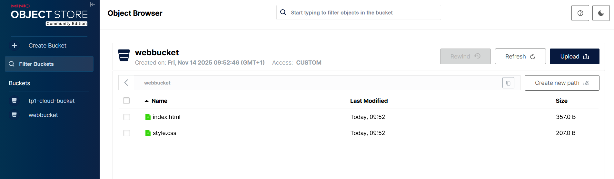
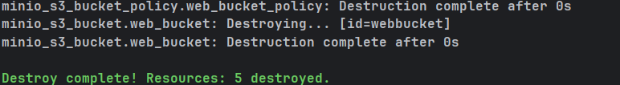

# TP1-Cloud

Ce dépôt contient le code source et les ressources associées pour le TP1-Cloud. 
Ce projet vise à fournir une introduction aux concepts fondamentaux du cloud computing, y compris le déploiement d'applications et la gestion des ressources.

## Première étape : Configuration de l'environnement

Avant de commencer, installer les éléments suivants installés sur votre machine :

- MinIO : https://dl.min.io/server/minio/release/
- OpenTofu : https://opentofu.org/docs/
- AWS CLI (facultatif) : https://aws.amazon.com/cli/

Pour lancer MinIO, utilisez la commande suivante :

```bash 
    minio server ~/minio-data --console-address ":9001"
```

Accédez à l'interface web de MinIO à l'adresse http://localhost:9001 et connectez-vous avec les identifiants par défaut (utilisateur : `minioadmin`, mot de passe : `minioadmin`).

## Deuxième étape : Déploiement avec OpenTofu

Pour le déploiement j'utilise donc OpenTofu avec la configuration de base suivante :

```hcl
terraform {
  required_providers {
    minio = {
      source  = "terraform-provider-minio/minio"
      version = ">= 3.1.0"
    }
  }
}

provider "minio" {
  minio_server = "127.0.0.1:9000"
  minio_user = "minioadmin"
  minio_password = "minioadmin"
}

resource "minio_s3_bucket" "tp1_bucket" {
  bucket = "tp1-cloud-bucket"
  acl    = "private"
}
```

Nous avons créer le bucket `tp1-cloud-bucket` dans MinIO avec cette configuration.

Pour appliquer cette configuration, exécutez les commandes suivantes dans le répertoire contenant le fichier de configuration OpenTofu :

```bash
opentofu init
opentofu apply
```

(comme le bucket MinIO dans votre cas).
Résumé des commandes utiles :
```hcl
tofu fmt : Formate le code
tofu init : Initialise le répertoire de travail
tofu plan : Prévisualise les changements
tofu apply : Applique les changements
tofu destroy : Détruit l'infrastructure
```

## Troisième étape : Création d'un bucket pour un site web statique

Pour héberger un site web statique, nous devons créer un bucket avec par exemple la configuration suivante :

```hcl
resource "minio_s3_bucket" "web_bucket" {
  bucket = "webbucket"
  acl = "public"
}

resource "minio_s3_object" "index_html" {
  bucket_name = minio_s3_bucket.web_bucket.bucket
  object_name = "index.html"
  source = "index.html"
  content_type = "text/html"
}

resource "minio_s3_object" "style_css" {
  bucket_name = minio_s3_bucket.web_bucket.bucket
  object_name = "style.css"
  source = "style.css"
  content_type = "text/css"
}

resource "minio_s3_bucket_policy" "web_bucket_policy" {
  bucket = minio_s3_bucket.web_bucket.bucket

  policy = jsonencode({
    Version = "2012-10-17"
    Statement = [
      {
        Effect = "Allow"
        Principal = "*"
        Action = ["s3:GetObject"]
        Resource = ["arn:aws:s3:::${minio_s3_bucket.web_bucket.bucket}/*"]
      }
    ]
  })
}
```

Cette configuration crée un bucket nommé `webbucket`, y télécharge deux fichiers (`index.html` et `style.css`), et définit une politique de bucket pour rendre les objets accessibles publiquement.

Cette politique rend tous les fichiers du bucket accessibles publiquement en lecture seule, ce qui est nécessaire pour héberger un site web statique. 
Sans cette politique, même avec acl = "public", les fichiers ne seraient pas accessibles via une URL directe.

Après avoir ajouté cette configuration, exécutez à nouveau les commandes `opentofu init` et `opentofu apply` pour créer le bucket et télécharger les fichiers sur MinIO.

### Accéder au site web statique

Pour accéder au site web statique hébergé dans le bucket `webbucket`, utilisez l'URL suivante dans votre navigateur web :

```
http://localhost:9000/webbucket/index.html
```

Screen shot de MinIO affichant les fichiers du bucket webbucket :



## Quatrième étape : Secret et variables

Création du fichier `variables.tf` pour gérer les variables sensibles.

Ainsi que le fichier `secrets.tfvars` pour stocker les valeurs sensibes dans mon cas : username et password.
ACLs des buckets opti. 


## Cinquième étape : Nettoyage


Pour nettoyer les ressources créées, exécutez la commande suivante :

```bash
    opentofu destroy
```



Recréez les buckets avec : 

```bash
    opentofu apply
```


